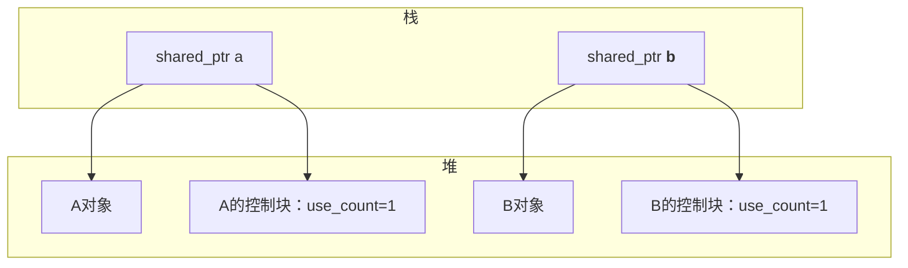
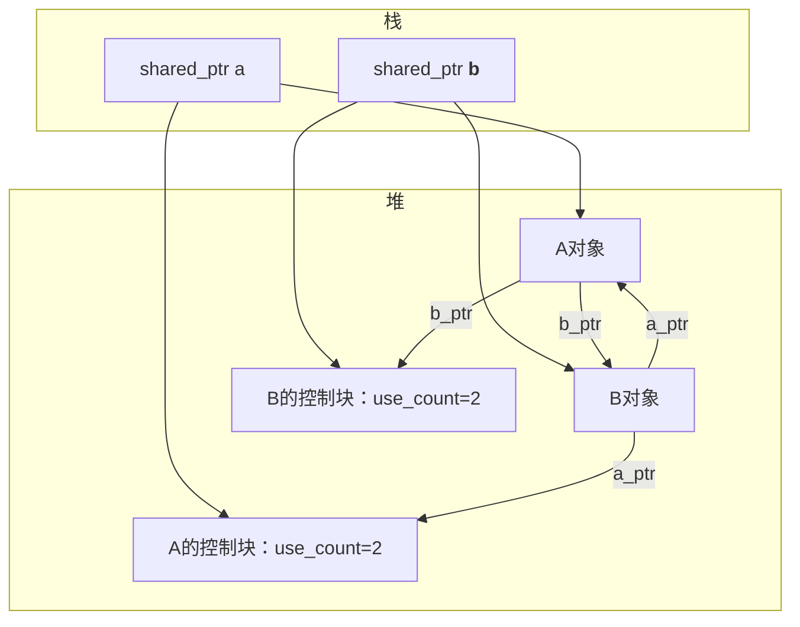
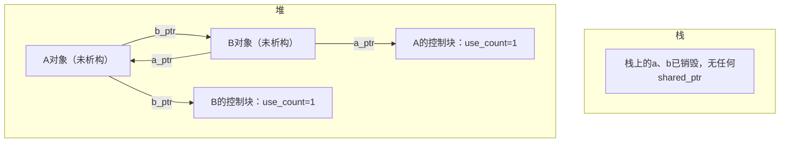

彻底搞懂**循环引用导致内存泄漏的底层逻辑**，而不只是知道“会泄漏”这个结论，我会从`shared_ptr`的内存布局、引用计数的生命周期、对象销毁的条件这三个核心维度，一步步拆解这个过程，让你看清每一步的内存变化。

### 前置知识：先明确两个关键概念
在分析前，必须先分清两个容易混淆的对象，这是理解的核心：
| 类型                | 存储位置 | 生命周期                | 作用                     |
|---------------------|----------|-------------------------|--------------------------|
| `shared_ptr`对象本身 | 栈（如局部变量） | 随作用域结束自动销毁    | 管理堆对象，维护引用计数 |
| `shared_ptr`管理的对象 | 堆       | 引用计数为0时自动销毁   | 业务逻辑的实际对象（如A、B） |

简单说：栈上的`shared_ptr`是“管理者”，堆上的对象是“被管理者”；管理者的使命是：**当所有管理者都消失/放弃管理时，销毁被管理者**。

### 一、先看`shared_ptr`的底层结构（简化版）
`shared_ptr`内部包含两个核心指针（可理解为）：
1. **指向堆对象的指针**：比如指向A、B的指针，用于访问业务对象；
2. **指向“控制块”的指针**：控制块是`shared_ptr`创建时在堆上额外分配的一块内存，核心包含：
   - `引用计数（use_count）`：记录当前有多少个`shared_ptr`指向该堆对象；
   - `析构函数指针`：用于最后销毁堆对象；
   - 其他辅助信息（如自定义删除器等）。

**核心规则**：只有当`use_count == 0`时，`shared_ptr`才会：
- 调用堆对象的析构函数；
- 释放堆对象的内存；
- 释放控制块的内存。

### 二、循环引用导致内存泄漏的完整过程（逐行拆解）
我们回到之前的循环引用代码，**逐步骤模拟内存和引用计数的变化**，用可视化的方式展示每一步的状态：

#### 步骤1：创建A、B的`shared_ptr`（无互相引用）
```cpp
shared_ptr<A> a = make_shared<A>(); // 栈上创建a，堆上创建A对象+A的控制块
shared_ptr<B> b = make_shared<B>(); // 栈上创建b，堆上创建B对象+B的控制块
```
此时内存状态：

- A的引用计数`use_count=1`（只有栈上的`a`指向它）；
- B的引用计数`use_count=1`（只有栈上的`b`指向它）。

#### 步骤2：互相引用，形成循环
```cpp
a->b_ptr = b; // A对象的b_ptr（shared_ptr<B>）指向B对象
b->a_ptr = a; // B对象的a_ptr（shared_ptr<A>）指向A对象
```
此时内存状态发生关键变化：

- A的`use_count`从1→2：因为**栈上的a** + **B对象里的a_ptr** 都指向A；
- B的`use_count`从1→2：因为**栈上的b** + **A对象里的b_ptr** 都指向B。

#### 步骤3：main函数结束，栈上的`a`和`b`销毁
当程序执行到`main`函数末尾，栈上的`shared_ptr`对象`a`和`b`会被自动销毁（这是栈对象的特性）。

销毁过程中，每个`shared_ptr`都会做一件事：**将自己管理的堆对象的引用计数减1**。
- 销毁`b`：B的`use_count`从2→1；
- 销毁`a`：A的`use_count`从2→1。

此时的内存状态：


#### 步骤4：致命问题：引用计数永远无法归0
此时的核心矛盾：
- A对象的`use_count=1`，这个计数是由**B对象里的a_ptr** 持有的；
- B对象的`use_count=1`，这个计数是由**A对象里的b_ptr** 持有的；
- 但A、B对象要析构，必须等自己的`use_count=0`；而要让`use_count=0`，必须先销毁对方对象里的`shared_ptr`；但对方对象要销毁，又得等自己的`use_count=0`……

这就形成了**死锁式的闭环**：
> A想析构 → 必须先让B析构（释放B里的a_ptr） → B想析构 → 必须先让A析构（释放A里的b_ptr） → 回到起点

最终结果：
- A、B对象的析构函数永远不会被调用；
- A、B对象占用的堆内存，以及它们的控制块内存，**直到程序退出前都无法释放** → 这就是内存泄漏。

### 对比：非循环引用的正常销毁（反例）
如果只有A持有B的`shared_ptr`，没有循环：
```cpp
shared_ptr<A> a = make_shared<A>(); // A: use_count=1
shared_ptr<B> b = make_shared<B>(); // B: use_count=1
a->b_ptr = b; // B: use_count=2

// main结束：
// 销毁a → A: use_count=0 → A析构 → A里的b_ptr销毁 → B: use_count=1
// 销毁b → B: use_count=0 → B析构
```
所有对象都能正常销毁，无泄漏。

### 总结
### 关键点回顾
1. **内存泄漏的核心原因**：循环引用让两个对象的引用计数互相“托底”，都无法降至0，导致堆对象的析构函数不执行、内存无法释放；
2. **关键混淆点**：栈上的`shared_ptr`会销毁，但堆上的业务对象（A、B）因为引用计数未归0，始终“存活”在堆中；
3. **泄漏的本质**：程序运行期间，这部分内存被永久占用，无法被复用，长期运行会导致内存占用持续升高，最终可能引发OOM（内存耗尽）。

简单说，循环引用就像两个人互相抓着对方的手，都喊“你先松手我就松手”，但最终谁都松不了手，只能一直“占用”内存，直到程序强制结束。
